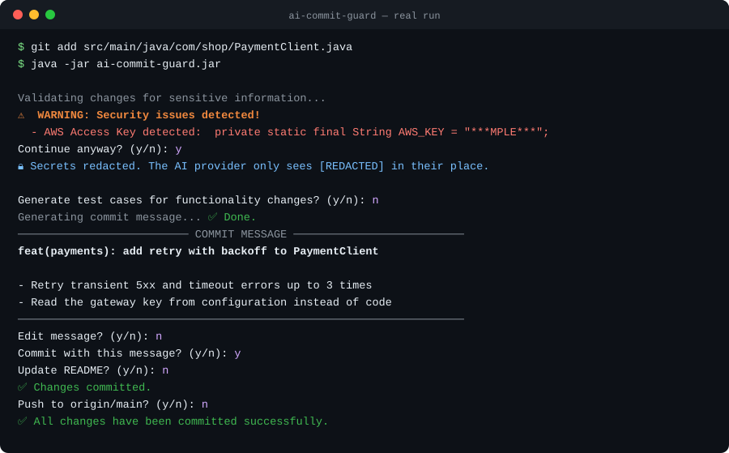
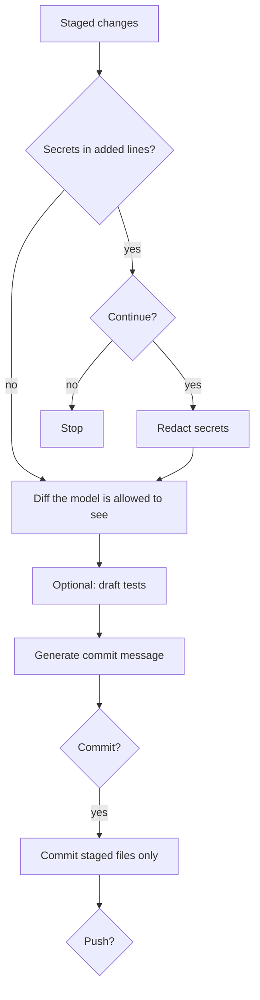

<h1 align="center">🛡️ AI Commit Guard</h1>

<p align="center">
  <b>The AI commit assistant that won't leak your secrets.</b><br>
  It catches credentials in your staged changes, redacts them before the LLM sees anything,<br>
  then writes a clean Conventional Commits message for you.
</p>

<p align="center">
  <a href="https://github.com/santanusetu/ai-commit-guard/actions/workflows/build.yml"></a>
  
  
  
</p>

<p align="center">
  
</p>

## Why

AI commit tools send your diff to a model. Your diff is exactly where secrets leak: a key pasted in to test something, a `.env` that slipped into `git add .`. Most tools send it anyway.

AI Commit Guard puts a guard in front of the model:

- 🔍 **Scans before it sends.** Every line you're adding is checked for credentials first.
- 🔒 **Redacts, even if you continue.** The AI provider only ever sees `[REDACTED]` in place of a secret. The demo above is a real run: the request the model received contained `AWS_KEY = "[REDACTED]"`.
- ✋ **Commits only what you staged.** Unstaged and untracked files are never swept in behind your back.

## Features

| Feature | What it does |
|---|---|
| 🔍 **Secret scanning** | AWS keys, GitHub tokens (classic and fine-grained), Slack tokens, OpenAI and Anthropic keys, private keys, `password=` / `token=` assignments, and `.env` files |
| ✍️ **Commit messages** | [Conventional Commits](https://www.conventionalcommits.org/) (`feat`, `fix`, `refactor`, ...) with a summary of 72 characters or less, editable before you commit |
| 🧪 **Test drafts** | 1–2 tests for the file you changed: JUnit, pytest, or `*.test.js/ts`, saved where each ecosystem expects them |
| 📝 **README upkeep** | Updates the relevant sections and adds a dated changelog entry |
| 🔌 **Any OpenAI-compatible model** | OpenAI by default; point it at Azure OpenAI, a gateway, or a local model with Ollama |
| ✋ **You approve every step** | Tests, message, commit, README and push are each a yes/no prompt |
| 💬 **Slack** (optional) | Posts each commit message to a channel |

## Quick start

```bash
git clone https://github.com/santanusetu/ai-commit-guard.git
cd ai-commit-guard && mvn -q package        # builds target/ai-commit-guard.jar

export OPENAI_API_KEY=your-api-key
cd ~/code/your-project && git add -p
java -jar ~/ai-commit-guard/target/ai-commit-guard.jar
```

Tip: `alias gcg='java -jar ~/ai-commit-guard/target/ai-commit-guard.jar'` and run `gcg` instead of `git commit`.

Want to try it safely first? [`examples/calculator`](examples/calculator) is a small Java project with a [testing guide](examples/calculator/TESTING_GUIDE.md) of changes to stage and commit.

## How your code and secrets are handled

| Guarantee | How |
|---|---|
| Only the lines you **add** are scanned | Removing a leaked key is the fix, so deleted and unchanged lines never raise a warning |
| Secrets are **never sent to the model** | Each detected secret is replaced with `[REDACTED]` before the request, even after you choose to continue |
| Only what you **staged** is committed | The only extra files committed are ones this tool wrote for you (a saved test, an updated README) |
| Nothing is **pushed** without asking | Push is its own prompt, after the commit |

Pattern matching catches the common credential formats but is not a full secret scanner. For CI-grade coverage, pair it with [gitleaks](https://github.com/gitleaks/gitleaks).

## How it works



| Component | Responsibility |
|---|---|
| `SecurityValidationService` | Scans added lines for secrets and redacts them |
| `GitService` | Reads the staged diff (HEAD vs index) with JGit, commits, pushes |
| `AIService` | One chat-completion client for messages, tests and README text |
| `ReadmeService` | Creates or updates `README.md` and adds changelog entries |
| `SlackService` | Optional webhook notification |

## Configuration

| Variable | Required | Default | Purpose |
|---|---|---|---|
| `OPENAI_API_KEY` | yes | | API key (any non-empty value for a local server that needs none) |
| `OPENAI_MODEL` | no | `gpt-4o-mini` | Model name |
| `OPENAI_BASE_URL` | no | `https://api.openai.com/v1` | Any OpenAI-compatible endpoint, e.g. `http://localhost:11434/v1` for Ollama |
| `SLACK_WEBHOOK_URL` | no | | Slack incoming webhook for commit notifications |

## Development

```bash
mvn test      # 29 tests, fully offline
mvn verify    # what CI runs on Java 11, 17 and 21
```

Git operations are tested against temporary repositories, and the AI client against a local stub server, so no API key or network is needed.

## License

[MIT](LICENSE) © Santanu Chakraborty
